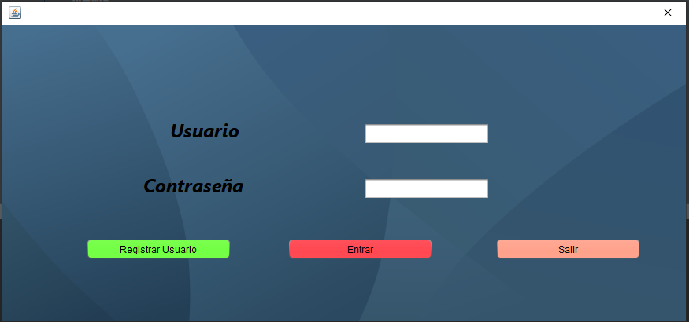
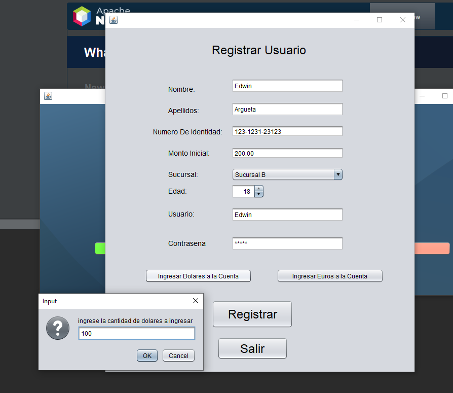
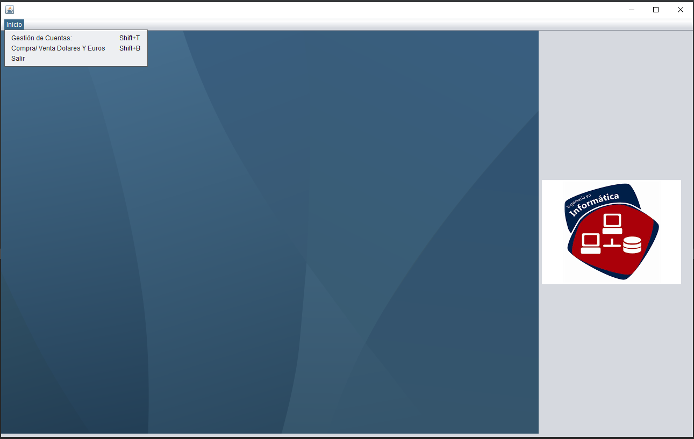
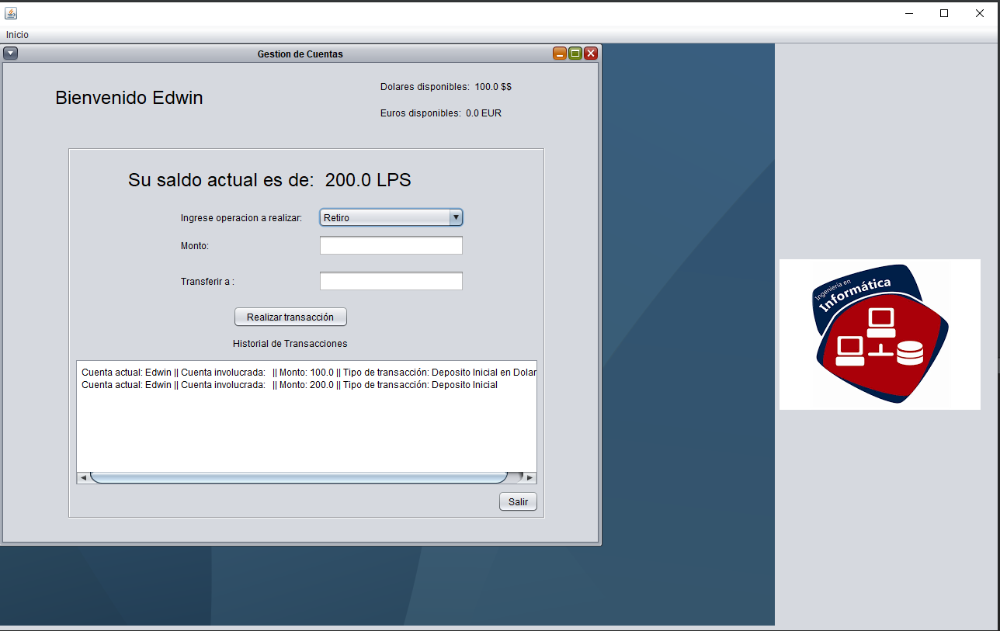
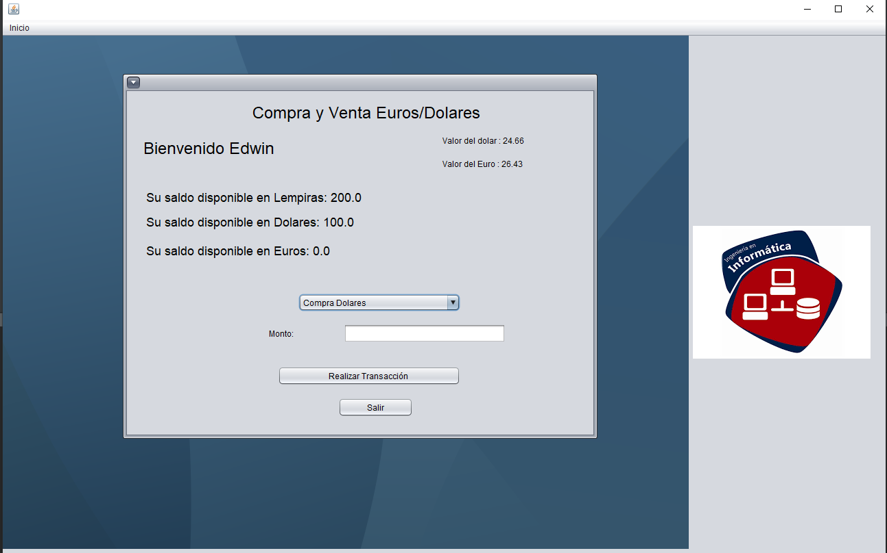

# Bank Simulation App

## Overview!

**Fully Functional Bank Simulation(without DataBase)**

In this project, I created a fully functional bank simulation app using Java as a college project. The app allows users to register, deposit money in dollars, euros, and lempiras, view their balances, and make transfers between accounts. Additionally, the app generates a log of all transactions and any errors that occur during execution in a TXT file.

Instead of using a database, I implemented the storage and management of data using two-dimensional arrays.

This bank simulation app was built entirely by myself, ensuring a user-friendly interface and accurate handling of financial transactions. The use of Java helped streamline the functionality and robustness of the application.